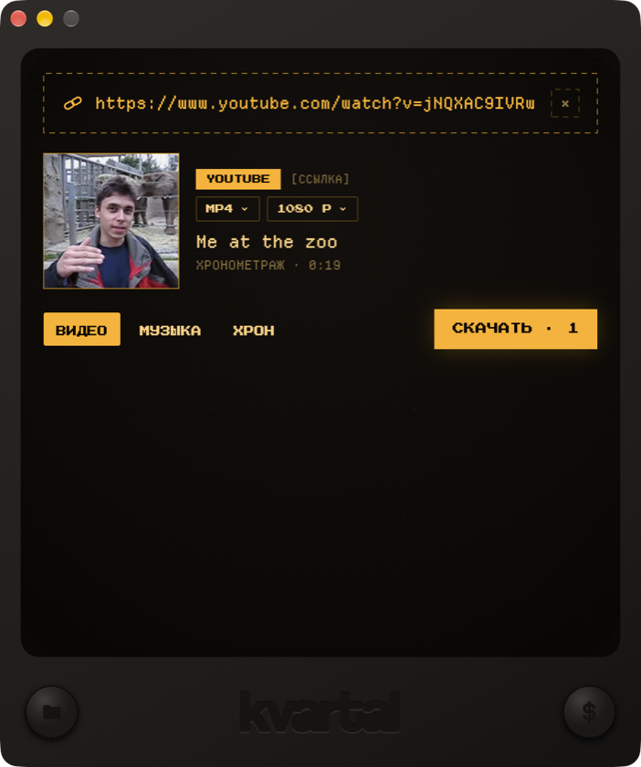

<p align="center">
  
</p>

# K LOAD

**Загрузчик музыки и видео для macOS и Windows. Вставь ссылку — получи файл.**

[](https://github.com/americanboy1855/k-load/actions/workflows/win-build.yml)
[](../../releases/latest)

- **Источники:** YouTube · TikTok · Instagram · Spotify · Apple Music · SoundCloud · Pinterest
- **Режимы:** ВИДЕО (до 4K) · МУЗЫКА (MP3, FLAC, WAV) · **ХРОН** — вырезка фрагмента по таймкодам «ОТ–ДО»
- **Пачка ссылок** с разных сервисов вперемешку и **плейлисты целиком** (недоступные ролики пропускаются)
- **Поиск по названию**: помнишь только строчку из песни — пишешь текст, приложение находит трек
- **Диспетчер загрузок**: очередь, две загрузки параллельно, пауза с докачкой; готовый файл перетаскивается мышью в любую программу — со всех источников
- **Автообновление**: новая версия сама предложит установку одной кнопкой
- Папка на выбор, ретро-телевизор и янтарный фосфор. Работает сразу после установки — все инструменты в комплекте

## Скачать

**[→ Последняя версия в Releases](../../releases/latest)** — рядом с установщиком лежит **K-LOAD-Instrukciya.pdf** (инструкция с картинками).

### macOS 10.15+ (Apple Silicon и Intel)

1. Скачай **K-LOAD-…-setup.pkg** и открой его.
2. macOS предупредит, что сборка не проверена Apple — нажми **Готово**, это нормально.
3. **Системные настройки → Конфиденциальность и безопасность → «Открыть в любом случае»** → введи пароль.
4. Готово: вставь ссылку — и жми **СКАЧАТЬ**.

### Windows 10/11 (x64)

1. Скачай **K-LOAD-…-Setup.exe** и запусти.
2. Установка на русском, без прав администратора. SmartScreen: **«Подробнее» → «Выполнить в любом случае»** (сборка не подписана).
3. Новая версия ставится поверх старой — файлы и настройки остаются.

Файлы сохраняются в «Загрузки/K LOAD». Папку можно изменить кнопкой-папкой в левом нижнем углу.

## Использование

1. Вставь ссылку или напиши название трека.
2. Выбери режим: **ВИДЕО**, **МУЗЫКА** или **ХРОН** (фрагмент «ОТ–ДО»).
3. **СКАЧАТЬ** — прогресс в диспетчере; готовый файл можно перетащить мышью прямо в DAW, плеер или письмо.

## Важно

Используйте K LOAD только для контента, на который у вас есть права: собственные записи, открытые лицензии или разрешение правообладателя. Загрузка материалов с DRM невозможна.

## Сборка из исходников

Интерфейс — Flutter, ядро — C++17 (`kdcore`, без JUCE), скачивание — yt-dlp + ffmpeg.

```sh
# ядро + тесты (macOS; на Windows — CMake + Visual Studio 2022)
cd kdcore && cmake -B build -G Ninja -DCMAKE_BUILD_TYPE=Release && cmake --build build && ./build/kd_tests

# приложение, дев-сборка macOS (подпись вне iCloud-зоны)
cd app && flutter pub get && ../mac/dev-build.sh

# релизный установщик macOS
cd app && flutter build macos --release && cd .. && ./mac/build-pkg.sh

# Windows: ядро + приложение + Inno Setup одним скриптом
pwsh win/build.ps1 -Installer
```

Инструменты (yt-dlp, ffmpeg, deno) в git не входят: `core/fetch-tools.sh` (macOS) и `win/fetch-tools-win.ps1` (Windows) докачают их автоматически.

## Внутри

Flutter (интерфейс) + C++-ядро через FFI: очередь на двух воркерах, распознавание сервисов, поиск по каталогам, предсказание имён файлов. yt-dlp и ffmpeg — в комплекте установщика (лицензии — в пакете, папка tools/LICENSES).

---

© kvartal records · 2026 · [boosty.to/kvartalrecords](https://boosty.to/kvartalrecords/donate)
